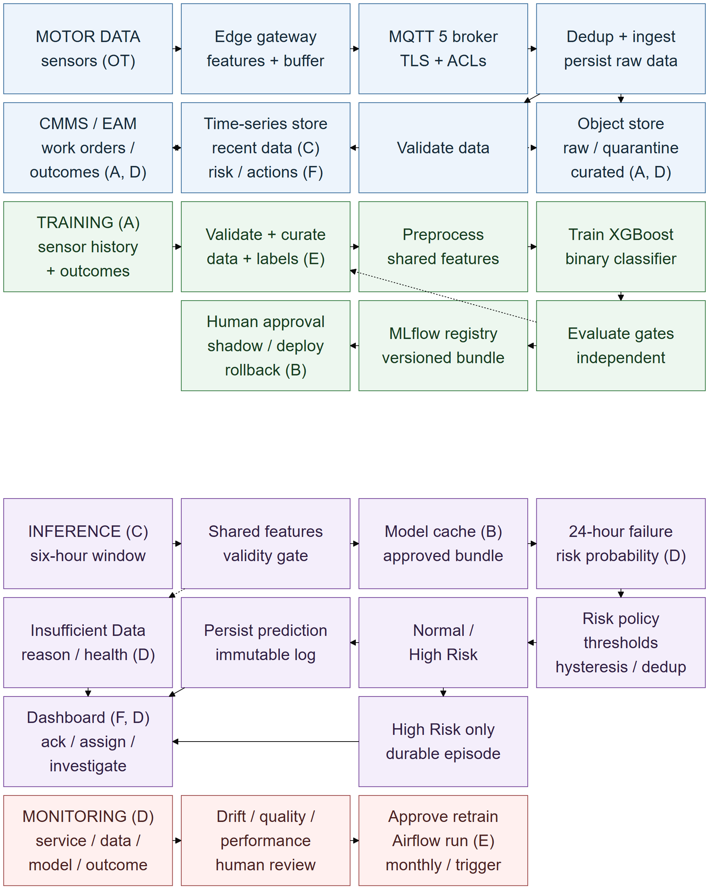

# DDM501 Individual Assignment 1

**ML System Design Document: Predictive Maintenance for Industrial Motors Using IoT Sensor Data**

This repository contains the research, design documents, reviews, and final submission for DDM501 - AI in DevOps, DataOps, MLOps. The proposed system predicts whether an industrial motor is at high risk of failure within the next **24 hours**, using recent vibration, temperature, electrical-current, and rotational-speed (RPM) measurements.

The deliverable is a system design document. Fleet sizes, service targets, model thresholds, and expected benefits are explicitly identified as design assumptions or proposed targets. No trained model, operational deployment, or achieved performance is claimed.

## Final submission

| Document | Purpose |
|---|---|
| [Final report (PDF)](final/DDM501_Assignment1_25ms13292_NgoAnhDuc.pdf) | The 27-page submission document. |
| [Final report (DOCX)](final/DDM501_Assignment1_25ms13292_NgoAnhDuc.docx) | Editable document corresponding to the PDF. |
| [Final report source](final/report.md) | Markdown source for reviewing the report content. |
| [Final delivery audit](review/final-delivery-audit.md) | Rubric coverage, Figure 1 readability, citation integrity, and conversion checks. |

The final delivery audit dated **3 October 2026** records **PASS**: all 37 checklist requirements are covered, with zero CRITICAL issues, zero MAJOR issues, and zero unresolved citation/evidence issues. Three MINOR findings remain: table pagination/word wrapping, historical tracking records, and figure/caption pagination. See the audit for their locations and scope.

## System scope

- **Task:** binary classification of motor failure risk within the next 24 hours.
- **Outputs:** `Normal` or `High Risk`, plus a failure-risk probability. `Insufficient Data` is a data-quality/service state.
- **Primary model:** one proposed XGBoost classifier; deterministic rules and logistic regression are evaluation baselines.
- **Users:** Maintenance Engineer, Plant Operations Manager, and ML / Platform Engineer, with supporting security and data-steward roles.
- **Business objective:** reduce unplanned motor downtime while limiting unnecessary maintenance and excessive false alarms.
- **Deployment design:** edge acquisition, feature extraction, and buffering; centralized on-premises training and inference; a maintenance dashboard and alerts; controlled monitoring and retraining.

Maintenance actions remain subject to human review. Predictions have no command path to motor actuation.

## Architecture



The four bands show acquisition/storage, training, inference, and monitoring/retraining. Matching letters connect transfers between bands: **A** carries curated history and approved outcomes to training; **B** carries an approved bundle or rollback to inference; **C** carries validated recent data to inference; **D** carries data health, serving telemetry, and matured outcomes to monitoring; **E** returns approved retraining to batch validation; **F** returns predictions, alert state, and workflow actions to the operational store. Solid arrows show routine flows; dotted arrows show invalid-data or failed-evaluation paths.

- **Training:** data ingestion and storage -> validation/curation -> shared preprocessing/features -> training -> independent evaluation -> model registry -> approved deployment.
- **Inference:** new sensor data -> validation and shared features -> deployed model -> risk probability/class -> persisted prediction -> dashboard/alerts.
- **Feedback:** monitoring and reviewed outcomes -> investigation -> approved retraining -> evaluation and controlled promotion or rejection.

See the [architecture design](design/architecture.md), [Mermaid source](diagrams/architecture.mmd), and [SVG export](diagrams/architecture.svg). The final report's Section 4 contains the integrated narrative and component inventory.

## Repository guide

| Path | Contents |
|---|---|
| [`assignment/`](assignment/) | Original assignment specification and submission requirements. |
| [`scenario.md`](scenario.md) | Fixed prediction task, inputs, stakeholders, and scope. |
| [`research/`](research/) | Rubric checklist, evidence ledger, research notes, assumptions, and BibTeX references. |
| [`design/`](design/) | Requirements, goals/metrics, architecture, and trade-off analysis. |
| [`diagrams/`](diagrams/) | Mermaid architecture source and PNG/SVG exports. |
| [`drafts/`](drafts/) | Earlier report versions retained for revision history. |
| [`review/`](review/) | Rubric, evidence, consistency, source, and final delivery reviews. |
| [`final/`](final/) | Final Markdown, DOCX, and PDF deliverables. |
| [`PLAN.md`](PLAN.md) | Work stages and historical progress tracking. |
| [`AGENTS.md`](AGENTS.md) | Project workflow, evidence rules, and quality gates. |

The authoritative inputs are the [original assignment PDF](assignment/INDIVIDUAL%20ASSIGNMENT%201.pdf) and [`scenario.md`](scenario.md). For current delivery status, use the [final delivery audit](review/final-delivery-audit.md); the plan and rubric checklist retain some earlier source-stage statuses.

## Reading and updating the documents

Clone the repository and open the final PDF or Markdown source:

```sh
git clone https://github.com/Lucyfer7566/ddm501-assignment1.git
cd ddm501-assignment1
```

The PDF can be read directly without a development environment. For design traceability, consult the [rubric checklist](research/rubric-checklist.md), [source ledger](research/sources.md), and [assumptions register](research/assumptions.md), then the design and review documents.

When revising the project:

1. Preserve the authoritative assignment and fixed 24-hour binary prediction scope.
2. Keep sourced facts, design assumptions, engineering decisions, and proposed targets distinct.
3. Update the affected design documents and final report source consistently.
4. Refresh the diagram exports and DOCX/PDF when their sources change; editing Markdown or Mermaid does not automatically regenerate the delivered files.
5. Repeat the rubric, evidence, consistency, and final delivery checks, including normal-page diagram readability.

Verified references are recorded in [`research/references.bib`](research/references.bib). Public Paderborn and CWRU datasets are considered for prototyping only; they are not presented as production data with native 24-hour failure labels or as evidence of this proposed system's performance.
